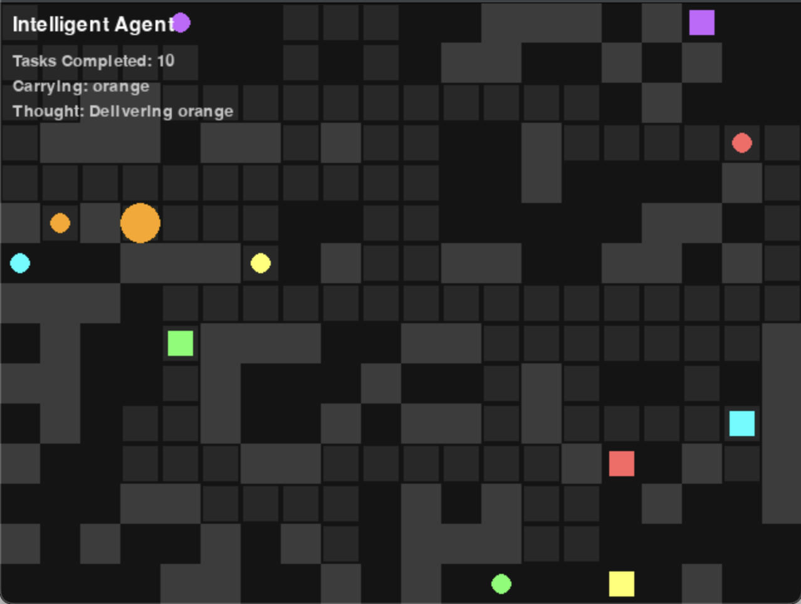

# Intentional agent simulation

A Python simulation that visualizes an intentional agent navigating a grid environment using planning, decision-making, and goal-directed behavior. Built with `pygame` and `pymunk`.



## Features

- Agent with intentions and goals
- Pathfinding and planning logic
- Interactive simulation with real-time rendering
- Obstacles, goal targeting, and visited path visualization


##  Getting started

### 1. Clone the repository

```bash
git clone https://github.com/HananeLaassilia/Intentional_agent.git
cd Intentional_agent
```
### 2. Install the dependencies 

```bash
pip install -r requirements.txt
```
### 3. Run the simulation

```bash
python main.py
```

